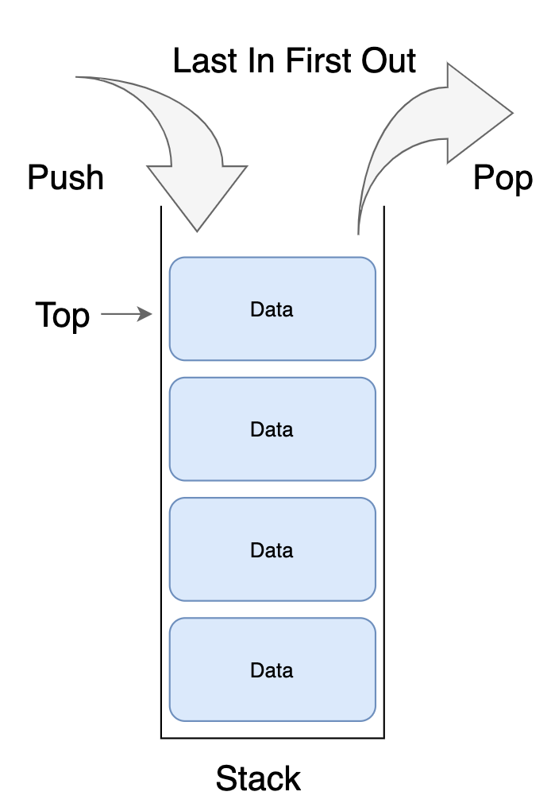

# Stack

데이터를 차곡차곡 쌓아올린 형태의 자료 구조. 가장 마지막에 삽입된 자료가 가장 먼저 삭제되는 구조. FIFO(Last In First Out). 꽉 찬 상태를 overflow, 완전히 빈 상태를 underflow라고 한다. 삽입(Push)과 삭제(Pop)모두 top에서 일어나기 때문에 시간복잡도는 O(1)이다.

웹브라우저 방문 기록 중 뒤로가기, 	실행 취소, 역순 문자열 만들기, 후위 표기법

<div align = "center">
</div>

### Push

- 스택이 가득 찼는지 확인
- 가득 차면 오류 발생 후 종료
- 스택이 가득차지 않았으면 차지 않으면 top을 증가시킨다.
- Top이 가리키는 스택 위치에 데이터를 추가한다.

### Pop

- 스택이 비어있는aaaaaaaaaaaaaaasaa\\\\\\\\\\\\\\\\\지 확인한다.
- 비어있다면 오류 발생 후 종료
- 스택이 비어있지 않다면 top이 가리키는 데이터를 제거한다.
- top을 제거 후 성공을 반환한다.

## 시간복잡도

| Operation | Average | Worst |
| --- | --- | --- |
| Access | Θ(n) | O(n) |
| Search | Θ(n) | O(n) |
| Insert (push) | Θ(1) | O(1) |
| Delete (pop) | Θ(1) | O(1) |

## 구현

- 배열로 구현: 구현이 쉬우나 크기가 정적으로 런타임시 필요에 따른 크기 확보가 불가능하다.
- 연결리스트로 구현: 크기가 동적으로, 런타임시 필요에 따라 크기 확보가 가능하지만, 포인터를 위한 추가 메모리 공간이 필요하다.

### 스위핑 Sweeping

한 쪽 방향부터 시작해서 다른 방향으로 스캔해 가면서 쓸어가는 해결 기법, 좌표가 있는 문제에서 주로 사용한다. 조금 다른 말을 하면, 정렬된 순서대로 처리되는 이벤트의 집합으로 문제를 모델링 하는 것이다.

### 분리집합 Disjoint Group

### 예외처리 try / except

다음은 파이썬으로 stack클래스의 pop함수를 구현한 것이다.

```python
def pop(self)
		try:   # pop할 아이템이 없으
				return self.items.pop()
		except indexError: 발생
				print("stack is empty")
```

# Stack을 이용한 계산기

## infix 와 postfix

infix는 사람들이 사용하는 이항 연산자를 가운데에다가 적는 형식을 말한다면, postfix는 이항 연산자를 피연산자 두개의 바로 뒤에 적음으로써 컴퓨터가 연산을 용이하게 진행하는데에 도움을 준다.

**infix → postfix**

1. 두 피연산자를 묶는 괄호를 만든다.
2. 오른쪽 괄호 바깥쪽에 가운데에 있던 연산자를 옮겨 준다.
3. 괄호를 없앤다.

$3*(2+5)*4$ <infix> → $3*(25+)*4$ →  $325+*4*$

컴퓨터가 infix를 postfix로 바꾸는 과정과 postfix로 만들어진 식 모두 스택을 활용하여 계산이 진행된다.

**infix를 postfix로 바꾸는 과정**

리스트: outstack <<postfix저장/ 스택: opstack <<연산자 저장

```python
#슈도코드임
for each token in expression:
		if token == operand:
				outstack.append(token)
		if token == '(':
				outstack.push(token)
		if token == ')':
				opstack에 저장된 연산자를 '('가 pop될때까지 outstack에 append
		if token '+-*/':
				opstackdp에 있는, token보다 우선순위 높은 연산자를 모두 pop하고 자신을 push한다.
		그 이후 opstack에 남아있는 연산자를 모두 pop하여 outstack에 append
```
<br>

**postfix의 수식을 계산하기**: 연산자가 나오면 피연산자 두개를 pop하여 순서에 맞춰 계산한 후 결과를 push한다.
